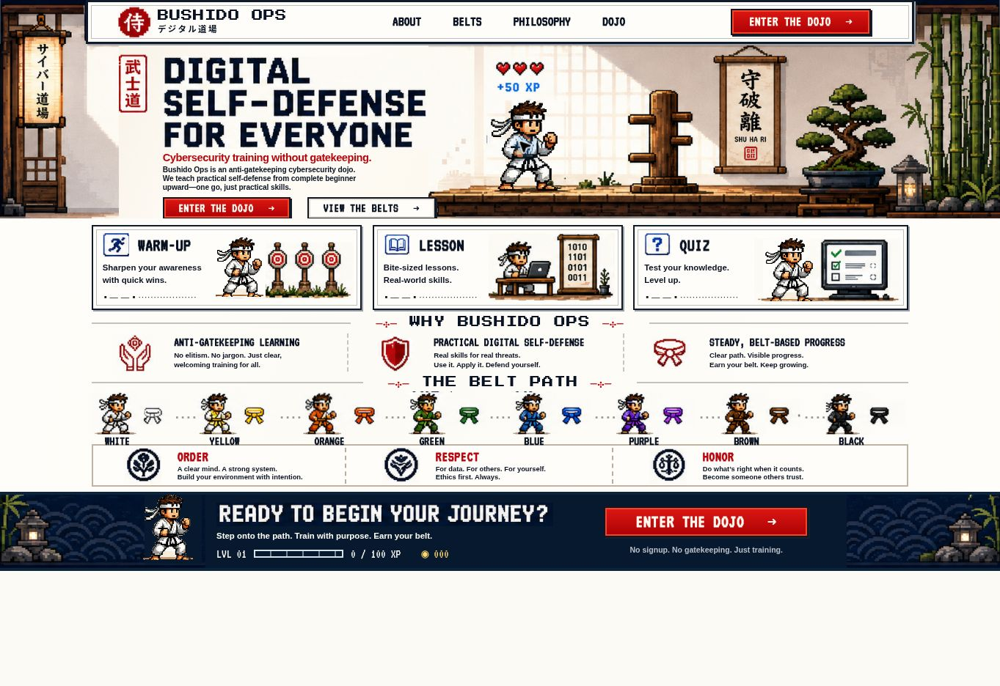

# Bushido Ops

A pixel-art cybersecurity dojo for practical digital self-defense. This is the interactive, animated prototype: the landing page leads into a playable white-belt phishing exercise.



## What works

- Responsive home page, dojo navigation, and eight belt previews.
- Original pixel-art characters with very small, occasional idle motion and a single brief reaction on mouse hover or keyboard focus. No automatic punches.
- Warm-up, short lesson, and three-question quiz with explanations and retries.
- Session XP: 20 for the warm-up, 30 for the lesson, and 50 for a perfect quiz. Each module awards once per session.
- Keyboard-accessible controls and support for reduced-motion preferences.

Only the white-belt pilot is playable. Progress is held in memory and resets when the page reloads. Learner accounts, persistent progress, and the remaining curriculum are future work.

## Run locally

Requirements: Node.js 22.13.0 or later and pnpm 11.25.0, as pinned in `package.json`.

```sh
git clone https://github.com/dbottali/bushido-ops.git
cd bushido-ops
pnpm install --frozen-lockfile
pnpm dev
```

Open the local URL printed by the development server. A clean clone uses the portable development profile.

## Check and build

```sh
pnpm exec tsc --noEmit
pnpm build
pnpm start
```

The production build creates a Cloudflare Worker and browser assets in `dist/`. `pnpm start` previews that build locally through Wrangler.

## Deployment

This repository contains the full application source. The current review deployment is hosted through Sites and is separate from GitHub.

The Worker build requires a compatible hosting runtime. GitHub Pages uses the dedicated browser-only build, which preserves the animated home and the playable pilot:

```sh
pnpm dev:pages
pnpm build:pages
```

The static build is generated in `dist-pages/`, with asset URLs configured for `https://dbottali.github.io/bushido-ops/`. Copy the contents of that directory into the repository root for branch-based GitHub Pages publishing. [Deployment instructions](docs/PAGES.md).

## Stack and project notes

React 19, TypeScript, Vinext/Vite, Tailwind CSS, Radix UI, and Cloudflare Workers. Artwork and local fonts are included under `public/`.

- [Project brief and roadmap](docs/PROJECT.md)
- [Validation and known limitations](docs/QA.md)
- [Platform and runtime details](docs/PLATFORM.md)

This replacement is committed on top of the previous repository history. Earlier versions remain available through Git.
