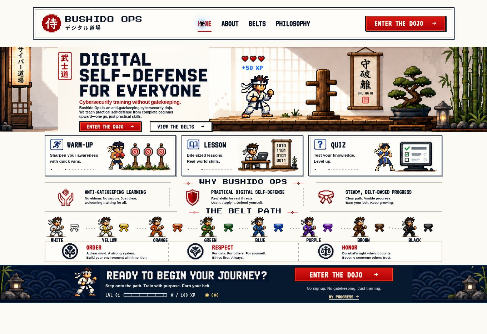

# Bushido Ops

A pixel-art cybersecurity dojo for practical digital self-defense. This interactive, animated prototype includes a playable white-belt phishing exercise and dedicated About, Belts and Philosophy pages.



## What works

- Responsive home page and shared navigation: Home, About, Belts, Philosophy and Enter the Dojo use the same header on every page.
- Explicit ivory page background and light color scheme, with a viewport-unit fallback for browsers without container query units.
- Belts: eight selectable curriculum previews, practical missions, live White Belt progress and a Continue action that opens the first incomplete pilot module.
- About: the mission, who the dojo is for, an interactive training overview, belt availability and expandable FAQs. Every training preview links to its playable pilot module.
- Philosophy: Order, Respect and Honor, with practical habits, expandable scenarios and a personal dojo code with browser-local saved choices.
- 8-bit fighters: a Ryu-style main hero, a boxer for Warm-up, and a Chun-Li-inspired fighter for Quiz. Small idle movements and one complete-body punch on mouse entry or keyboard focus, with no automatic punches.
- Warm-up and Quiz start with the clean scene while their fighters load, preventing a brief flash of the original Ryu illustration on Home and About.
- Warm-up, short lesson, and three-question quiz with explanations and retries.
- Saved pilot progress: 20 XP for the warm-up, 30 for the lesson, and 50 for a perfect quiz. Each module counts once, including after reload or retry.
- Resume the first incomplete module. Unfinished answers and submitted feedback survive reloads.
- Export, validate and import a JSON backup, or reset progress with confirmation, from Belts → Your Progress.
- Keyboard-accessible controls and support for reduced-motion preferences.

Only the white-belt pilot is playable. Progress saves on this browser when local storage is available. Export/import transfers it between devices; there is no account or automatic cloud synchronization. If storage fails, training remains usable with a visible temporary-session notice. The remaining curriculum and belt advancement are future work.

## Run locally

Requirements: Node.js 22.13.0 or later and pnpm 11.25.0, as pinned in `package.json`.

```sh
git clone https://github.com/dbottali/bushido-ops.git
cd bushido-ops
pnpm install --frozen-lockfile
pnpm dev
```

Open the local URL printed by the development server. A clean clone uses the portable development profile.

## Check and build

```sh
pnpm exec tsc --noEmit
pnpm test:progress
pnpm build
pnpm start
```

The production build creates a Cloudflare Worker and browser assets in `dist/`. `pnpm start` previews that build locally through Wrangler.

## Deployment

This repository contains the full application source and a browser-only build for GitHub Pages. The earlier Sites review deployment is separate and is not updated by a GitHub upload.

The Worker build requires a compatible hosting runtime. GitHub Pages uses the dedicated browser-only build, which preserves the animated home and the playable pilot:

```sh
pnpm dev:pages
pnpm build:pages
```

The static build is generated in `dist-pages/`, with asset URLs configured for `https://dbottali.github.io/bushido-ops/`. Copy the contents of that directory into the repository root for branch-based GitHub Pages publishing. [Deployment instructions](docs/PAGES.md).

## Stack and project notes

React 19, TypeScript, Vinext/Vite, Tailwind CSS, Radix UI, and Cloudflare Workers. Artwork and local fonts are included under `public/`.

- [Project brief and roadmap](docs/PROJECT.md)
- [Validation and known limitations](docs/QA.md)
- [Characters and 8-bit animation](docs/CHARACTERS.md)
- [Philosophy content and interactions](docs/PHILOSOPHY.md)
- [About content and navigation](docs/ABOUT.md)
- [Belts curriculum and saved progress](docs/BELTS.md)
- [Progress model, backups and storage](docs/PROGRESS.md)
- [Upload the latest infrastructure update](docs/INFRASTRUCTURE-UPDATE.md)
- [Upload the latest loading fix](docs/LOADING-FIX.md)
- [Upload the Belts update](docs/BELTS-UPDATE.md)
- [Upload the About update](docs/ABOUT-UPDATE.md)
- [Upload the Philosophy update](docs/PHILOSOPHY-UPDATE.md)
- [Upload this animation update](docs/ANIMATION-UPDATE.md)
- [Platform and runtime details](docs/PLATFORM.md)

The ready-to-upload update preserves the existing project. Committing it to the current branch keeps earlier versions available through Git.
