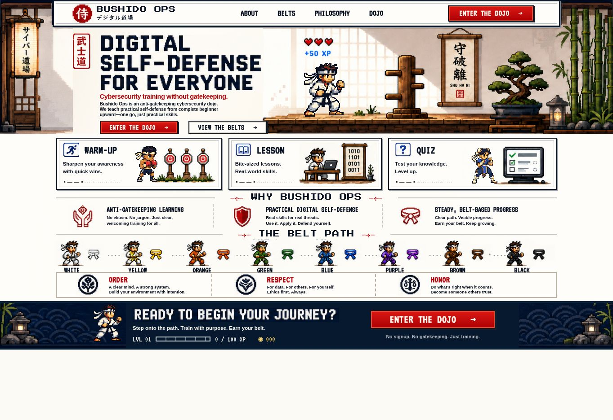

# Correzione del primo frame — 4 ottobre 2026

Warm-up e Quiz mostravano brevemente Ryu perché l’immagine originale restava sotto le sprite durante il caricamento. Le due card ora usano lo sfondo pulito dal primo render, sia nella Home sia nelle anteprime About. Il pugile e la combattente in stile Chun-Li compaiono quando le rispettive sprite sono pronte.

Verificato con sprite trattenute in caricamento, caricamento riuscito e caricamento fallito. TypeScript e build GitHub Pages completati. Animazioni e stile 8 bit mantengono il comportamento approvato.

## Caricamento su GitHub

1. Estrai `bushido-ops-loading-fix.zip`.
2. Apri `dbottali/bushido-ops` sulla branch `main`.
3. Usa **Add file → Upload files** e trascina il contenuto interno della cartella estratta nella radice del repository.
4. Crea il commit, ad esempio `Fix fighter flash during loading`.
5. Attendi il deploy Pages in **Actions**, poi apri il sito e ricarica con **Command + Shift + R**.

Il pacchetto è cumulativo: comprende anche About, Belts, Philosophy e il pilot. Non richiede file nascosti. I sorgenti e i file compilati aggiornati sono entrambi inclusi.
