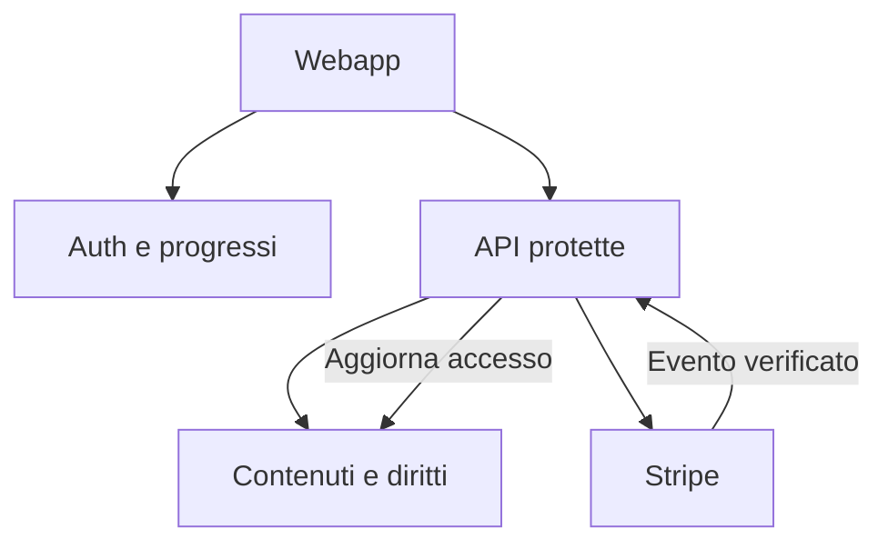

# Bushido Ops — specifiche verso la 1.0

Data: 6 ottobre 2026. Product owner: Damiano. Stato: progetto delle funzionalità future, incluso nella release 0.4.

La 0.4 implementa l'ottimizzazione mobile. Account, sincronizzazione, nuovo curriculum e pagamenti descritti qui sono specifiche da implementare in seguito. Nessun servizio è stato attivato e nessuna spesa o pubblicazione è stata eseguita.

## 1. Mobile — implementato nella 0.4

- Un unico header su Home, About, Belts, Philosophy, My Dojo e training.
- Su smartphone, menu espandibile con le cinque destinazioni esistenti e accesso al dojo sempre visibile. Escape chiude il menu e restituisce il focus; una destinazione selezionata lo chiude.
- Comandi del menu di almeno 44 px, CTA di 48 px, risposte con altezza minima di 56 px e testo di 16 px.
- Hero più leggibile, schede ridisposte e backup con campo testo leggibile senza zoom automatico dovuto a font piccoli.
- Sprite completi e palette 8 bit conservati. Timer di 100 ms coerente con i fotogrammi esistenti; arresto fuori schermo, a pagina nascosta e con movimento ridotto. Il footer fermo non avvia un ciclo continuo.
- Tap touch/pen distinto dallo scorrimento per la breve reazione del personaggio. L'esercizio non dipende dall'animazione.

Verifica: TypeScript, 22 test del modello e build Pages; build framework locale; sette pagine a quattro larghezze, menu e pilota completo in Chrome. Il controllo su un telefono/iPad fisico con questa release resta da fare. Non è una PWA e non installa un'app.

## 2. Account — proposta concreta

### Esperienza iniziale

La bianca resta utilizzabile come ospite. Alla fine di una missione, un invito facoltativo propone di salvare il percorso su più dispositivi. Nessuna registrazione prima del primo esercizio.

Prima modalità proposta: email e password con verifica dell'email e recupero tramite servizio gestito. Evitare più modalità social nel primo rilascio. Gli invii richiedono un servizio email transazionale configurato e una prova su Safari e Brave, inclusa l'apertura del link in un browser diverso.

| Stato | Bianca | Premium disponibile | Progressi | Modifica contenuti |
|---|---|---|---|---|
| Ospite | Sì | No | Nel browser, con backup | No |
| Account gratuito | Sì | No | Sincronizzati | No |
| Abbonamento attivo | Sì | Sì, con prerequisiti didattici | Sincronizzati | No |
| Abbonamento scaduto | Sì | No | Conservati; rinnovo riprende il percorso | No |
| Proprietario | Secondo accesso assegnato | Secondo accesso assegnato | Propri | Pubblicazione dal repository; editor futuro separato |

Pagare concede il diritto di accesso; superare le verifiche concede una cintura. Sono due stati separati. Non associare il ruolo editoriale alla registrazione o all'abbonamento. Gli studenti non possono editare il materiale.

### Dati e responsabilità

Schema proposto, senza migrazioni o tabelle create nella 0.4:

| Entità | Chiave / informazioni | Regola |
|---|---|---|
| Profilo | ID del servizio auth, nome opzionale | Lo studente legge/modifica solo il proprio nome; nessun ruolo assegnabile dal client |
| Progressi | Utente + corso + modulo, versione contenuto, risposte, completamento | ID stabili del catalogo; aggiornamento autenticato e validato |
| Tentativi | Utente, modulo, risposte, esito, data | Esito calcolato dal server per verifiche che assegnano cinture |
| Cinture ottenute | Utente + cintura, regola/versione, data | Assegnazione server; unicità per cintura e regola |
| Abbonamento | Utente, cliente Stripe, stato, scadenza del diritto | Scrittura solo dal servizio server che gestisce eventi verificati |
| Eventi pagamento | ID evento Stripe, stato elaborazione | Un evento duplicato non concede diritti o addebiti doppi |
| Catalogo | ID, versione, disponibilità, prerequisiti, livello accesso | Contenuti pubblicati dal proprietario; materiale premium fuori dal bundle pubblico |

L'email rimane nel sistema di autenticazione: non usarla come identificativo permanente. Nessun profilo pubblico, chat o classifica nel primo rilascio.

API proposte: lettura del proprio percorso; salvataggio del modulo; invio verifica; anteprima/importazione locale; caricamento contenuto autorizzato; avvio checkout e portale abbonamento. Il server ricava l'utente dalla sessione, valida gli ID e applica permessi e prerequisiti. La chiave amministrativa del database e il segreto Stripe non arrivano nel browser.

### Passaggio dai progressi locali

1. Dopo il primo accesso, rilevare il profilo locale valido e mostrare una sintesi di cosa verrà importato.
2. Chiedere una scelta esplicita: importare oppure mantenere il percorso dell'account. Non sovrascrivere silenziosamente.
3. Importare solo corsi/moduli riconosciuti e risposte valide. Conservare i completamenti già presenti, senza duplicare XP; non sovrascrivere tentativi più recenti senza una scelta dell'utente.
4. I dati importati non provano pagamento o superamento di un esame. Il pilota può essere conservato come pratica storica; le future cinture richiedono la verifica prevista.
5. Confermare il salvataggio remoto prima di considerare concluso il trasferimento. Lasciare il backup locale disponibile.

Per la sincronizzazione, usare revisioni del record e rifiutare scritture su una revisione superata, mostrando un conflitto da risolvere. Mai far tornare incompleto un modulo già completato per un semplice salvataggio tardivo da un altro dispositivo.

### Criteri di accettazione prima della 1.0

- Accesso verificato, recupero e disconnessione funzionanti; scadenza della sessione gestita senza perdere la risposta corrente.
- Un secondo utente non legge o modifica i dati del primo; database con policy per utente e test delle API protette.
- Stesso progresso su due dispositivi; importazione esplicita e XP non duplicati.
- Export e cancellazione account con conseguenze spiegate, inclusa la gestione separata dell'abbonamento attivo.
- Accesso premium controllato sul server; esami e diritti non modificabili tramite backup o richieste client.

## 3. Percorso per cinture — proposta editoriale

Un'unica struttura: Warm-up → Lesson → Quiz. Sessioni proposte da 5–10 minuti, da misurare con persone reali. Le missioni qui sotto sono titoli e obiettivi di progettazione: non sono lezioni o nuovi quiz già disponibili.

| Cintura | Tema esistente | Risultato osservabile | Accesso | Ipotesi di rilascio |
|---|---|---|---|---|
| Bianca | Pause. Verify. Protect. | Davanti a una richiesta sospetta, scegliere un canale indipendente e proteggere informazioni sensibili | Free | Completa alla 1.0 |
| Gialla | Accounts & Identity | Preparare credenziali, MFA e recupero di un account di prova | Abbonamento | Primo gruppo premium |
| Arancione | Devices & Data | Configurare aggiornamenti, permessi e un backup; dimostrare un ripristino | Abbonamento | Primo gruppo premium |
| Verde | Networks & the Web | Motivare scelte su rete, Wi-Fi e navigazione | Abbonamento | Pianificata |
| Blu | Defensive Thinking | Prioritizzare difese secondo rischio e privilegi | Abbonamento | Pianificata |
| Viola | Investigation & Detection | Interpretare segnali e log in un laboratorio didattico | Abbonamento | Pianificata |
| Marrone | Incident Response | Eseguire un piano guidato di contenimento e recupero | Abbonamento | Pianificata |
| Nera | Practice & Mentorship | Completare e spiegare un progetto finale di difesa | Abbonamento | Pianificata |

### Bianca gratuita: confine proposto

Cinque missioni: pressione/urgenza; verifica del mittente e del canale; password e codici privati; link e richieste inattese; segnalazione e prima risposta. Il pilota sul phishing è il punto di partenza, non l'intera cintura.

Verifica finale proposta: uno scenario nuovo in cui lo studente deve motivare una scelta sicura. La bianca deve dare un risultato utile completo e un riconoscimento interno al dojo, senza obbligo di acquisto. Il premium approfondisce account e dispositivi.

### Primo premium sostenibile

Gialla: cinque missioni proposte su credenziali, password manager, MFA, recupero e sessioni/dispositivi. Arancione: cinque su aggiornamenti, permessi, dati, backup e ripristino. Scrivere e revisionare prima il piccolo catalogo iniziale; non promettere tutte le otto cinture come disponibili.

Regola proposta di avanzamento: completare le missioni obbligatorie e superare lo scenario finale. Soglia e prove pratiche si definiscono insieme al materiale; una soglia numerica non prova da sola l'apprendimento. Nessuna penalità per ripetere la pratica. XP descrittivo, calcolato dai completamenti unici; nessun acquisto di XP o cintura. L'attuale pilota mantiene la propria regola di 3/3 e i suoi 100 XP.

Bianca e teoria iniziale devono funzionare da smartphone. Per laboratori avanzati distinguere esercizi fruibili su telefono e attività che richiedono un computer, indicandolo prima di iniziare. Non promettere che un laboratorio Linux completo sia utilizzabile da mobile.

Prima di pubblicare: ciascuna missione deve avere obiettivo, versione, durata stimata, scenario, spiegazione degli errori, verifica del contenuto e indicazione del dispositivo richiesto. Nessuna certificazione accreditata implicita.

## 4. Hosting e sostenibilità — scelta candidata

Proposta PM: codice su GitHub, frontend statico su Cloudflare Pages, autenticazione/database su Supabase, abbonamento su Stripe Checkout/Billing con funzioni server per diritti e pagamenti. È una scelta da confermare prima di creare i servizi.

| Componente | Responsabilità | Preparazione richiesta |
|---|---|---|
| GitHub | Codice, revisioni e release | Protezione dei segreti; curriculum premium in area privata |
| Cloudflare Pages | Interfaccia, asset e dominio | Build con base URL del nuovo dominio, HTTPS, ambienti separati |
| Supabase | Auth, progressi, contenuti protetti | Regione UE, policy per utente, backup e prova di ripristino |
| Funzioni server | Verifiche, autorizzazioni, checkout, webhook | Segreti solo server, validazione input, eventi idempotenti |
| Stripe | Incassi, rinnovi e portale abbonamento | Ambiente test prima del live; stato accesso aggiornato da eventi verificati |
| Email e dominio | Verifica/recupero account e identità | SMTP transazionale configurato e dominio scelto dal proprietario |

Il ritorno dal checkout mostra l'esito di navigazione; non concede da solo accesso. Rinnovo, cancellazione, scadenza e pagamento fallito aggiornano il diritto dal server. La cancellazione a fine periodo conserva l'accesso fino alla scadenza confermata; i progressi restano dopo la scadenza.

### Costi e disciplina del primo esperimento

Ipotesi iniziale, da approvare: tetto di 100–200 EUR per validazione e primi servizi; 30–50 EUR/mese come budget tecnico orientativo al piccolo lancio. Non è un preventivo e non include ore, contenuti, imposte, commissioni o supporto. Monitorare spesa e ore separatamente.

Al 6 ottobre 2026, Cloudflare indica richieste statiche gratuite; funzioni e altri servizi hanno regole proprie. Supabase Pro parte da 25 USD/mese; il Free può essere sospeso per inattività. Il piano email va previsto separatamente. Ricontrollare prezzi, cambio e uso prima di acquistare.

Un solo piano premium, con accesso alle cinture premium effettivamente disponibili. Prezzo sperimentale proposto: 9 EUR/mese, non ancora approvato. Dieci abbonati darebbero 90 EUR mensili lordi, trenta 270: aritmetica, non previsione di domanda o utile. La priorità è provare che qualcuno completa la bianca e torna; poi verificare la disponibilità a pagare per materiale concreto.

GitHub Pages resta il prototipo attuale. Prima del lancio commerciale migrare: le condizioni di Pages escludono l'hosting gratuito di business/e-commerce/SaaS commerciali. Dominio previsto: `bushi.do`; registrazione e collegamento all'hosting non sono verificati in questa consegna.

### Passaggi di rilascio

1. Completare QA mobile fisico della 0.4 e approvare le specifiche.
2. Quando autorizzato, implementare account e sincronizzazione in un ambiente di test, con email di prova e nessun incasso live.
3. Inserire bianca completa e primo premium revisionato. Provare importazione, isolamento dati, esami, webhook duplicati, cancellazione e recupero account.
4. Organizzare una prova privata con 10–20 volontari solo su istruzione del proprietario; raccogliere completamento, comprensione, ritorno e motivi di acquisto.
5. Preparare candidata 1.0: costi, informazioni sui dati e sul servizio, prezzo, assistenza, backup/ripristino, dominio e trasferimento hosting. Decidere il lancio con Damiano.
6. Pubblicare e attivare pagamenti alla 1.0 dopo la decisione sul rilascio.

L'archivio 0.4 mantiene la base `/bushido-ops/` per il prototipo esistente. Un dominio alla radice richiederà una build con base `/`; non trasferire alla cieca i bundle Pages. La 0.4 non pubblica automaticamente il sito.

## Rimandato e vincoli permanenti

- Gli studenti non modificano mai il materiale.
- Editor/bozze/anteprima di authoring, se serviranno, saranno privati e riservati al proprietario o a editor autorizzati.
- Pannello preferenze rimandato; movimento ridotto del sistema già rispettato.
- PWA/app nativa da valutare dopo uso mobile ripetuto. Installazione, offline e premium offline richiedono progettazione separata.
- Nessuna nuova infrastruttura di test pesante: estendere controlli mirati quando si aggiungono auth, dati remoti e pagamenti.

## Fonti tecniche verificate il 6 ottobre 2026

- [Cloudflare Pages: prezzi di asset statici e Functions](https://developers.cloudflare.com/pages/functions/pricing/)
- [Supabase: piani e limiti](https://supabase.com/pricing)
- [Supabase: email con SMTP](https://supabase.com/docs/guides/auth/auth-smtp)
- [Stripe: eventi degli abbonamenti](https://docs.stripe.com/billing/subscriptions/webhooks)
- [GitHub Pages: condizioni e limiti](https://docs.github.com/en/pages/getting-started-with-github-pages/github-pages-limits)

Le scelte di prodotto, le missioni e i budget di questa specifica sono proposte del project manager; le fonti descrivono i servizi, non dimostrano domanda o sostenibilità del progetto.
